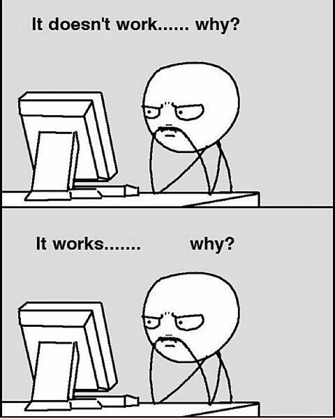

<!DOCTYPE html>
<html lang="en">
  <head>
    <meta charset="UTF-8">
    <meta name="viewport" content="width=device-width, initial-scale=1.0">
    <meta http-equiv="X-UA-Compatible" content="ie=edge">
    <link rel="stylesheet" href="./style.css">
  </head>
  <body>
    <main>
        <h1 style="text-align: center;">OOP & Data Structures</h1>
        

            
        

         
        
Made by KRU 15

    </main>
  </body>
</html>

## QnA

[QnA Programming Dagoz](https://docs.google.com/spreadsheets/d/1NAmqCGuPKkCch_pz_hYT8LrrLAAuoJQITHuoTIneYV4/edit?usp=sharing)

Jangan malu untuk bertanya!

## Description

### Specifications

### 1. Data Structures

Create a queue data structure in the form of a class with the following requirements:
1. The class name is Queue.
2. The queue can only store data with type string.
3. The queue capacity is limited to 10 (set it as a constant).
4. Has methods for:

    * Pushing a value to the back of the queue.
    * Popping a value on the front of the queue.
    * Checking if the queue is empty and full.
    * Getting the size (number of elements in the queue).

### 2. Object-Oriented Programming (OOP)

Create a class named `Pose2D` with the following attributes:

* `double x` - representing the x-coordinate
* `double y` - representing the y-coordinate
* `double ort` - representing the orientation (angle in degrees)

and the following methods:

* Default constructor - sets all attributes to 0
* User-defined constructor - allows initialization of attributes with custom values
* Operator== overloading - for comparing two Pose2D objects for equality
* Operator+ overloading - for adding two Pose2D objects
* Getter-setter for each attribute

Then, implement an abstract class called `SoccerRobot` that has the following attributes:
* `Pose2D pos` - representing the position of the robot in 2D space
* `int wheelCount` - representing the number of wheels the robot has
* `bool cameraStatus` - indicating the status of the camera (on/off)
* `double batteryPercentage` - representing the battery level of the robot (within the range of 0-100)
* `static int robotCount` - keeping track of the total number of robots created

This class also has a constructor that initializes the wheelCount to 4, calls the default constructor of Pose2D to set the initial position to (0,0) with 0 orientation, sets the cameraStatus to on, and sets the batteryPercentage to 100. Additionally, getter-setter functions should be created for each attribute, allowing access and modification of their values. 

This class also has some basic functionalities such as 
* `void move()` - to move to a position 
* `void recharge()` - to recharge the battery 
* Pure virtual function called `void celebrate()`

Within this abstract class, you have to create 2 derived classes (Keeper and Player) with the following specifications:

1. `Keeper`

    This derived class has an additional attribute called `expanderStatus` (`boolean`) and functions such as:
    * Default constructor - sets expanderStatus to false
    * Getter-setter for expanderStatus
    * `void saveBall()` - that can only be used when expanderStatus is true. When the condition is fullfilled, prints "Keeper saved the ball."
    * `void celebrate()` implementation from SoccerRobot that prints "Tú eres el mejor portero del mundo."

2. `Player`

    This derived class has additional attributes called `dribbleStatus` (`boolean`), `kickerStatus` (`boolean`), `isBallOnPossession` (`boolean`), and `capacitorChargePercentage` (`double` within the range 0-100). This class also has the following methods:
    * Default constructor - sets all atributes to false or 0
    * Getter-setter for each attribute
    * `void kick()` - that can only be used if the capacitor charge is not less than 50 and the ball is on possession. When both conditions are fulfilled, it sets kickerStatus to on, prints "Player kicked.", subtracts the capacitor charge by 50, and sets dribblerStatus, kickerStatus, and isBallOnPossession to false
    * `void getBall()` - sets isBallOnPossession and dribblerStatus to true, and then prints "Ball is on possession."
    * `void celebrate()` - prints "Siuuu."
    * `void chargeCapacitor()` - sets the capacitor charge to 100

Use **header files** to split between implementation and function declarations.

### Bonus Specifications
* Make the Queue data structure dynamic (doesn’t have a limited capacity).
* Create a user-defined constructor for SoccerRobot and its children.
* Create a copy constructor and destructor for each class you have created to better implement OOP principles.

## Deliverables

* Create a folder with your NIM as the folder name and another two folders inside with the title “datastructures” and “oop”. Implement your changes inside both folders.
* Create a README inside both folders explaining how to run and navigate through the program.
* Submit your work and change the repository to public.

## Assessment Criteria
* Correctness of the implementation.
* Code cleanliness.
* Documentations. (whether in the README or comments in the implementation)
* Git best practices.
